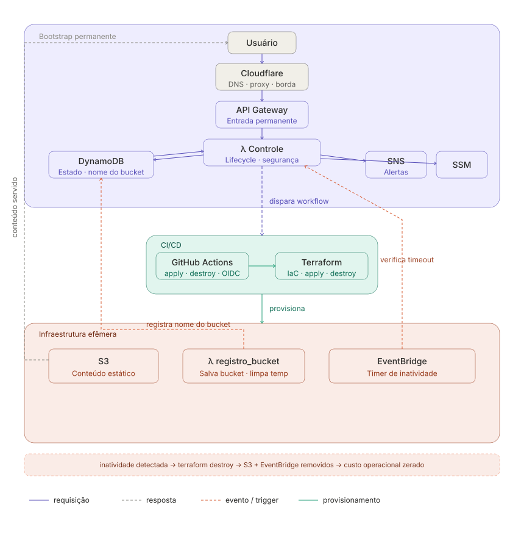
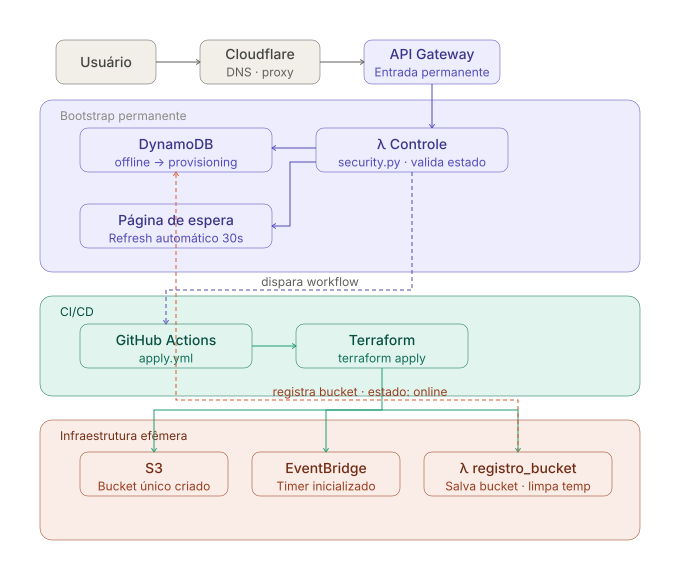
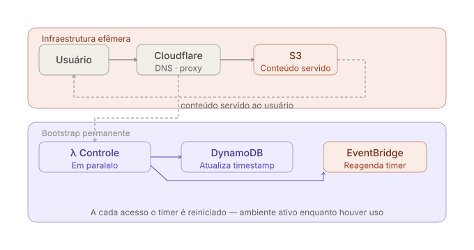
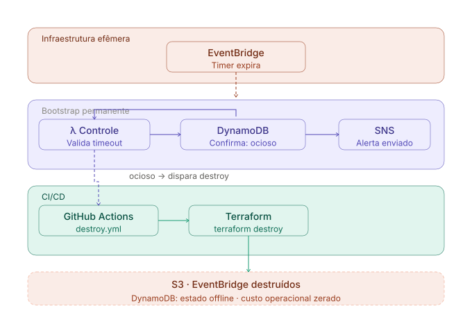

# Website Efêmero Serverless
### Infraestrutura Sob Demanda com AWS e Terraform

Infraestrutura que **não existe quando não é usada.**

Um ambiente serverless que provisiona a si mesmo no primeiro acesso e se destrói automaticamente após um período configurável de inatividade — mantendo custo operacional próximo de zero sem abrir mão de observabilidade, segurança e automação.

> **Trade-off consciente:** o primeiro acesso aguarda o provisionamento automático (~60 segundos). Esse comportamento foi aceito deliberadamente em troca de custo zero quando inativo.

---

## Por que isso existe

Ambientes de demonstração normalmente ficam ativos continuamente, consumindo recursos mesmo sem nenhum acesso. O custo individual é baixo — mas o modelo não demonstra nada interessante.

Este projeto responde a uma pergunta diferente:

> *É possível disponibilizar um site público sem mantê-lo permanentemente ativo?*

A resposta é sim. E o processo de chegar lá exige integrar lifecycle management, event-driven architecture, IaC, CI/CD, observabilidade e FinOps em um único fluxo coerente.

---

## Escopo do Projeto

O foco deste projeto está na arquitetura, automação de infraestrutura, lifecycle management, observabilidade, segurança e FinOps.
O frontend foi tratado como um meio para demonstrar o fluxo completo da solução. A interface foi gerada com apoio de IA generativa, e minha participação concentrou-se na definição do conteúdo, ajustes de texto e refinamentos de layout.

A decisão foi intencional: o objetivo era demonstrar a capacidade de projetar e implementar uma arquitetura serverless orientada a eventos, e não desenvolver uma aplicação frontend complexa.

As decisões de arquitetura, infraestrutura, automação, segurança, observabilidade, CI/CD e gerenciamento do ciclo de vida dos recursos em nuvem foram concebidas, implementadas e validadas por mim.

---

## Arquitetura

A solução é composta por uma camada permanente responsável pela orquestração do ciclo de vida da infraestrutura e por uma camada efêmera criada sob demanda para disponibilização do site.



| Componente | Camada | Responsabilidade |
|---|---|---|
| Cloudflare | Permanente | DNS, proxy e proteção de borda |
| API Gateway | Permanente | Único ponto de entrada público |
| λ Controle | Permanente | Decide: provisionar, servir ou destruir |
| DynamoDB | Permanente | Estado do ambiente e nome do bucket ativo |
| SNS | Permanente | Alertas operacionais; disponível antes do primeiro apply |
| SSM Parameter Store | Permanente | Parâmetros e secrets; lidos pelo Terraform durante o apply |
| GitHub Actions + Terraform | CI/CD | Executa `apply` ou `destroy` sob demanda via OIDC |
| S3 | **Efêmera** | Criado no primeiro acesso; destruído por inatividade |
| λ registro_bucket | **Efêmera** | Registra nome do bucket no DynamoDB; remove registro temporário |
| EventBridge | **Efêmera** | Timer de inatividade; existe apenas enquanto o ambiente está ativo |

---

## Fluxos operacionais

### Primeiro acesso (ambiente offline)



A Lambda Controle retorna imediatamente uma página de espera com refresh automático enquanto o workflow roda em segundo plano. O nome do bucket só é conhecido após o `apply` — por isso a `registro_bucket.py` registra o nome definitivo no DynamoDB e remove o registro temporário ao final do provisionamento.

### Ambiente ativo



A cada acesso, o timer é reiniciado. O ambiente permanece ativo enquanto houver uso.

### Inatividade (destruição automática)



Quando o timeout é confirmado, o `terraform destroy` remove S3 e EventBridge. O DynamoDB volta ao estado offline e o SNS — permanente — envia o alerta operacional imediatamente.

---

## Decisões arquiteturais

**Por que não usar apenas S3 estático?**
S3 resolveria o problema de hospedar um portfólio. O objetivo aqui era diferente: demonstrar que é possível tratar infraestrutura como um recurso dinâmico, criado e destruído por eventos, não como algo que simplesmente fica ligado.

**Por que aceitar a latência do primeiro acesso?**
O custo de manter S3 ativo continuamente é baixo em termos absolutos. A decisão foi manter a latência visível como demonstração honesta do trade-off — e documentá-la explicitamente em vez de escondê-la.

**Por que filtrar por comportamento da requisição e não por IP?**
Bloquear por IP exige listas de atualização contínua e tem falsos positivos altos (VPNs, IPs compartilhados). A filtragem comportamental — user-agent, headers de browser, método HTTP, path — identifica scanners e requisições automatizadas com base no que eles fazem, não em quem eles são. O efeito colateral útil: cada rejeição logada com motivo forma um dataset de tentativas ao longo do tempo.

**Por que o nome do bucket é registrado pela `registro_bucket.py` e não pelo Terraform?**
O bucket recebe um nome único por ciclo de vida — gerado durante o `apply`. Nesse momento o Terraform conhece o nome, mas a Lambda Controle (permanente) ainda não. A `registro_bucket.py` roda ao final do provisionamento, registra o nome definitivo no DynamoDB e remove o registro temporário. Isso mantém a camada permanente sempre sincronizada com o ambiente efêmero atual, sem acoplamento direto entre Terraform e Lambda.

**Por que o EventBridge é efêmero e não permanente?**
Quando o ambiente não existe, não há nada a verificar — um timer rodando em idle seria custo e ruído sem propósito. O EventBridge é criado junto com o S3 no `terraform apply` e destruído no `terraform destroy`. O timer só existe enquanto há algo a monitorar.

**Por que SNS e SSM são permanentes?**
SNS precisa estar disponível antes de qualquer `apply` para notificar falhas no próprio processo de provisionamento — se fosse efêmero, não haveria como alertar sobre erros na criação. SSM armazena parâmetros que o Terraform precisa ler durante o `apply`, então precisa existir antes do ambiente efêmero. Ambos têm custo mínimo e justificam a permanência.

**Por que OIDC entre GitHub Actions e AWS?**
Credenciais de longa duração (access keys) armazenadas em secrets do GitHub são um vetor de ataque. OIDC emite tokens temporários por workflow, sem segredos persistentes.

---

## Segurança

A superfície de ataque é mínima por design, com camadas de proteção independentes.

**Proteção de origem**

O bucket S3 não tem endpoint público. O acesso ao conteúdo é feito via Cloudflare, que atua como proxy — a origem S3 fica protegida atrás da camada de borda.

**Filtragem de acesso na Lambda Controle**

Antes de qualquer consulta ao DynamoDB ou disparo de provisionamento, o módulo `security.py` classifica cada requisição. Scanners e requisições automatizadas são rejeitados silenciosamente — o ambiente não é provisionado, nenhum custo é gerado.

A decisão é baseada no comportamento da requisição, não na origem do IP. VPNs passam normalmente.

| Verificação | Critério | Resultado |
|---|---|---|
| Bot permitido | User-agent contém: `googlebot`, `linkedinbot`, `slackbot`, `whatsapp`, outros | Passa direto |
| User-agent ausente | Header não enviado | Rejeitado |
| Scanner conhecido | User-agent contém: `shodan`, `censys`, `nmap`, `zgrab`, `masscan`, outros | Rejeitado |
| Path suspeito | `/.env`, `/.git`, `/wp-admin`, `/phpmyadmin`, `/admin`, outros | Rejeitado |
| Método não-GET | POST, PUT, DELETE, etc. | Rejeitado |
| Headers de browser ausentes | Sem `accept` ou sem `accept-language` | Rejeitado |

Bots de redes sociais e indexadores (LinkedIn, Slack, WhatsApp, Google) são explicitamente permitidos — necessário para que previews de link funcionem sem acionar provisionamento.

> **Nota para desenvolvedores:** requisições feitas com `curl`, `wget` ou `python-requests` são bloqueadas por design — esses user-agents estão na lista de scanners. Para inspecionar o endpoint manualmente, use um browser ou defina um user-agent customizado na requisição.

Cada rejeição é logada com motivo no CloudWatch, gerando um dataset de tentativas de acesso indevido ao longo do tempo.

**IAM e credenciais**

As IAM roles seguem least privilege: a role da Lambda tem permissão de leitura no DynamoDB, escrita nos logs e capacidade de disparar o workflow via API. Nada mais. As roles do Terraform têm escopo limitado aos recursos que provisionam.

A autenticação GitHub → AWS usa OIDC com condições restritas ao repositório e branch — um fork não consegue acionar os workflows.

```
Cloudflare               → proteção de borda, DDoS, rate limiting, origem oculta
API Gateway              → throttling de requisições
security.py              → filtragem comportamental antes do provisionamento
Lambda (least privilege) → só acessa o que precisa
S3 (sem acesso público)  → conteúdo acessível apenas via Cloudflare
OIDC (sem access keys)   → credenciais temporárias por execução
SSM Parameter Store      → sem secrets em variáveis de ambiente
```

---

## Observabilidade

Cada evento relevante do ciclo de vida gera um log estruturado no CloudWatch:

- Requisições recebidas (com estado do ambiente no momento)
- Início e conclusão de provisionamentos (com duração)
- Início e conclusão de destruições
- Reagendamentos do EventBridge
- Falhas em qualquer etapa (com contexto para diagnóstico)
- Execuções de workflow (resultado: success / failure)

Retenção configurada em 15 dias. Alertas críticos via SNS com destino configurável (e-mail, Slack, PagerDuty).

---

## Custo

| Situação | Custo estimado / mês |
|---|---|
| Ambiente inativo (sem acessos) | ~$0.05 |
| Ambiente ativo com tráfego baixo | ~$1–3 |
| Lambda Controle (1000 invocações) | < $0.01 |
| DynamoDB (On-Demand, uso mínimo) | < $0.01 |

O custo dominante quando inativo é o API Gateway (mínimo mensal). Todos os recursos efêmeros têm custo zero quando destruídos.

> Valores aproximados, sujeitos a alteração conforme região AWS e tabela de preços vigente.

---

## Estrutura do projeto

```
.
├── bootstrap/                          # Infraestrutura permanente
│   ├── api_gateway.tf
│   ├── dynamodb.tf
│   ├── iam_github_actions.tf
│   ├── iam.tf
│   ├── lambda.tf
│   ├── main.tf
│   ├── s3_backend.tf
│   ├── sns.tf
│   ├── variables.tf
│   └── lambda_src/                     # Lambda Controle — lifecycle do ambiente
│       ├── controle.py                 # Handler principal: provisionar, servir ou destruir
│       ├── aws_clients.py
│       ├── config.py
│       ├── dynamodb_service.py         # Leitura e escrita de estado
│       ├── eventbridge_service.py      # Criação e reagendamento do timer
│       ├── github_service.py           # Disparo dos workflows de apply/destroy
│       ├── html_pages.py               # Páginas de espera e erro retornadas ao usuário
│       ├── notification_service.py     # Envio de alertas via SNS
│       ├── parameters.py               # Leitura de parâmetros do SSM
│       ├── s3_service.py
│       └── security.py
├── efemero/
│   ├── terraform/                      # Infraestrutura efêmera
│   │   ├── backend.tf
│   │   ├── eventbridge.tf              # Timer de inatividade
│   │   ├── lambda.tf
│   │   ├── main.tf
│   │   ├── s3.tf                       # Bucket com nome único por ciclo
│   │   ├── variables.tf
│   │   └── lambda_src/
│   │       └── registro_bucket.py      # Registra nome do bucket no DynamoDB e remove registro temporário
│   └── website/
│       └── index.html                  # Conteúdo estático do portfólio
├── docs/
│   ├── arquitetura.svg
│   ├── fluxo_primeiro_acesso.svg
│   ├── fluxo_ambiente_ativo.svg
│   └── fluxo_inatividade.svg
├── teste/
│   └── test_security.py                # Testes unitários do módulo de segurança
├── pytest.ini                          # Configuração do pytest
└── README.md
```

---

## Testes

Testes unitários do módulo de segurança (`security.py`), cobrindo todos os cenários de filtragem sem dependência de rede ou AWS.

```bash
pip install pytest
pytest -v
```

Os testes validam: browsers legítimos, bots permitidos, scanners conhecidos, paths suspeitos, métodos HTTP inválidos, headers de browser ausentes e casos de borda (scanner embutido em user-agent composto, bot permitido sem headers de browser).

---

## Stack

**Cloud:** AWS Lambda (×2), API Gateway, S3, DynamoDB, EventBridge, SNS, IAM, SSM Parameter Store, CloudWatch · Cloudflare

**IaC:** Terraform

**CI/CD:** GitHub Actions com autenticação OIDC

**Linguagens:** Python (Lambda), HCL (Terraform), HTML/CSS (site estático)

---

## O que este projeto demonstra

Não é o jeito mais simples de hospedar um site. É uma demonstração de que infraestrutura pode ser tratada como um recurso dinâmico — com ciclo de vida controlado por eventos, provisionado sob demanda, destruído por inatividade, observado em cada etapa e protegido por design.

---

## Autora

**Carla Sampaio**

Arquitetura de Soluções, Engenharia de Dados e Automação de Ambientes Críticos.

[LinkedIn](https://linkedin.com/in/carlasampaio)
